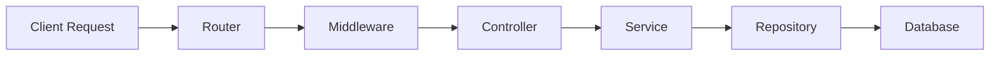
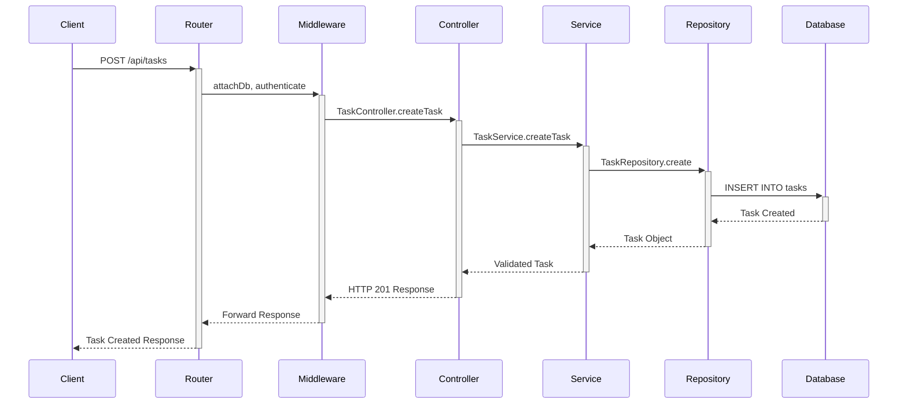

# Application Request Flow

## Overview

```mermaid
graph LR
    A[Client Request] --> B[Router]
    B --> C[Middleware]
    C --> D[Controller]
    D --> E[Service]
    E --> F[Repository]
    F --> G[Database]
```

## Request Flow Example: Creating a Task

```mermaid
sequenceDiagram
    Client->>+Router: POST /api/tasks
    Router->>+Middleware: attachDb, authenticate
    Middleware->>+Controller: TaskController.createTask
    Controller->>+Service: TaskService.createTask
    Service->>+Repository: TaskRepository.create
    Repository->>+Database: INSERT INTO tasks
    Database-->>-Repository: Task Created
    Repository-->>-Service: Task Object
    Service-->>-Controller: Validated Task
    Controller-->>-Middleware: HTTP 201 Response
    Middleware-->>-Router: Forward Response
    Router-->>-Client: Task Created Response
```